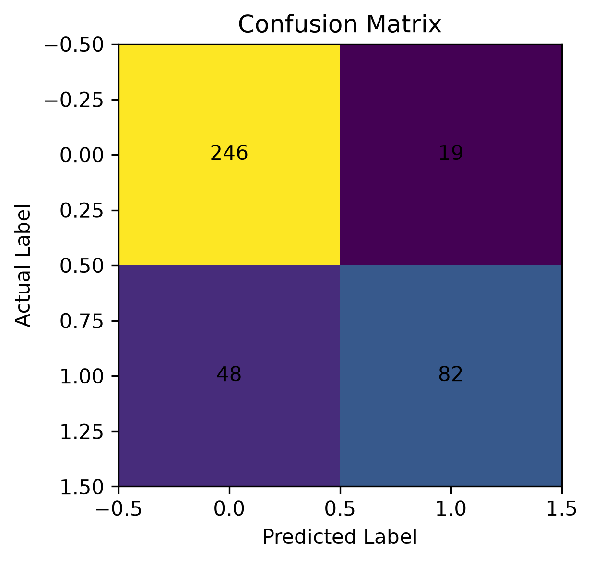
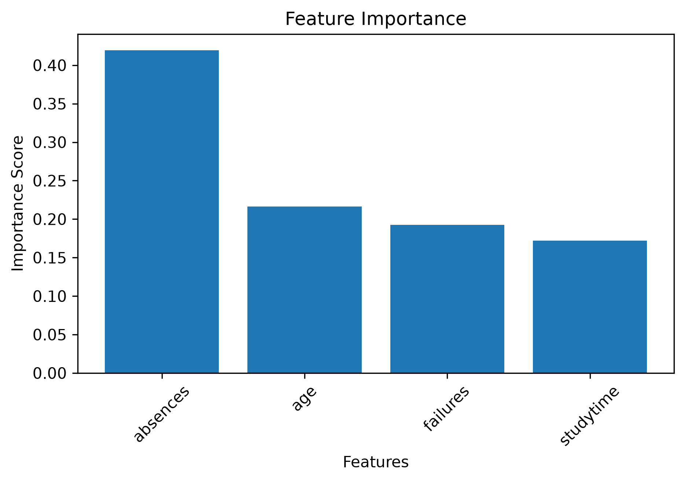

# Student Risk Prediction Model Report

## Model Details

**Algorithm:** Random Forest Classifier

**Features Used:**
- Age
- Study Time
- Previous Failures
- Absences

## Model Performance

### Accuracy

0.83

## Classification Report

```
              precision    recall  f1-score   support

           0       0.84      0.93      0.88       265
           1       0.81      0.63      0.71       130

    accuracy                           0.83       395
   macro avg       0.82      0.78      0.80       395
weighted avg       0.83      0.83      0.82       395

```

## Visualizations

### Confusion Matrix



### Feature Importance



## Conclusion

The model predicts student academic risk using selected features. Performance metrics and visualizations help analyze the model.